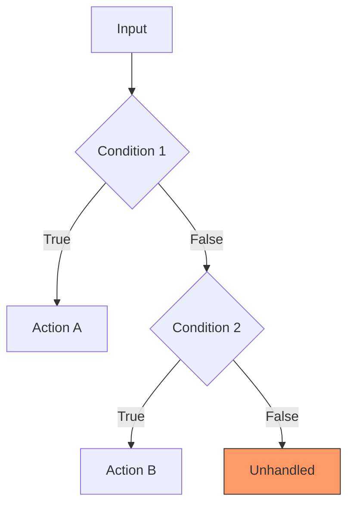

> Extracted from a production codebase's functional-review skill — content
> is already stack-agnostic, only the invocation shape was adapted. Run
> this **read-only**: no `Edit`/`Write` tool, so the reviewer can only
> critique, never quietly rewrite the code it's reviewing (the same
> "critique, don't rewrite" contract as a dedicated review agent — see the
> root README's Agent guidance). A capable reasoning-tier model is worth
> spending here: this is judgment-heavy, low-oracle analysis, not
> pattern-matching.

# Functional Review

A purely functional code review: verify that the **business logic** is
correct, complete, and is **the right logic** among all the possible
alternatives that could have been implemented instead.

**What this is not**: no style, no naming, no performance, no security, no
architecture opinions. The only question is: *does the code do what it
should do?*

## Theoretical foundations

| Technique                        | Source                                | Application                                              |
| ---------------------------------- | ---------------------------------------- | ------------------------------------------------------------ |
| **Fagan Inspection**                 | Fagan, 1976 (IBM)                           | Systematic checklist review against a specification            |
| **Decision Table Testing**             | Myers, *The Art of Software Testing*         | Are all combinations of conditions handled?                      |
| **Boundary Value Analysis**              | Myers, Sandler                                  | Boundary values at the edges of the domain                          |
| **Equivalence Partitioning**               | ISO 29119, ISTQB                                    | Is each input class represented?                                        |
| **State-Transition Analysis**                | Chow, 1978                                              | Are all states and transitions handled?                                     |
| **Mutation Analysis (thinking)**               | DeMillo, Lipton & Sayward, 1978                             | "What if this condition were inverted?"                                        |
| **Design by Contract**                          | Meyer, 1986 (Eiffel)                                            | Pre-conditions, post-conditions, invariants                                       |
| **Cause-Effect Graphing**                          | Myers, 1979                                                          | Is the causes → effects relation complete?                                           |

## Usage

- On its own, with no argument — auto-detect the modified files and
  analyze their logic.
- Given a specific file — targeted review of that file (plus its direct
  dependencies).
- Given a directory — review of the whole module.
- A whole-feature pass — follow the data flow end to end (entry point to
  final result) rather than file by file.

## Phase 1: Scope identification

### Auto-detection (no argument given)

```bash
git status --porcelain
BRANCH=$(git branch --show-current)

# If on a non-default branch, diff vs. the default branch; otherwise
# fall back to the last commit.
git diff --name-only <default-branch>...HEAD 2>/dev/null || git diff --name-only HEAD~1
```

Filter down to the files that actually carry logic (exclude config files,
styling, static assets, pure type declarations with no behavior).

### Given an argument

- A specific file: analyze it plus its direct dependencies.
- A directory: analyze every source file in it.
- A whole-feature pass: follow the data flow from the entry point (e.g. an
  API route, an event handler) through to the final result.

### Business context

Pull the context from whatever is available:

1. Branch name → linked issue number → the issue tracker's own view of it
2. Recent commit messages
3. In-code comments (docstrings, `// Business rule:` markers, etc.)
4. Schema/validation definitions (they describe the business constraints
   directly, often better than prose does)

## Phase 2: Functional analysis (per file)

Apply all eight lenses to each identified file.

### Lens 1 — Decision completeness (Decision Table)

> Do all combinations of conditions produce a defined result?

- Identify every decision point (`if`, `switch`, ternary, `??`, `||`).
- Build the decision table mentally.
- Check for a combination of conditions left uncovered.

**Red flags**: an `if`/`else if` chain with no final `else`; a `switch`
with no `default`; a compound condition (`A && B`) that never considers
`A && !B` or `!A && B`; a chain of `??`/`||` masking distinct cases behind
one another.

### Lens 2 — Boundary values (Boundary Value Analysis)

> Does the code behave correctly at the edges?

- Identify each value domain (numbers, lengths, dates, enums).
- Check behavior at: min, min-1, min+1, max, max-1, max+1, zero, empty.

**Red flags**: `>` vs. `>=` off-by-one errors; array edge cases (index 0,
last element, empty array); date edge cases (month/year boundaries, leap
years, timezones); numeric edge cases (0, negatives, `NaN`, `Infinity`);
string edge cases (empty, one character, very long, special characters).

### Lens 3 — Input classification (Equivalence Partitioning)

> Is every valid *and* invalid input class handled?

- List the possible input types/classes for each public function.
- Check that each class has a defined execution path.

**Red flags**: a string parameter with no handling for `""` or
whitespace-only input; a numeric parameter with no handling for `NaN`,
`Infinity`, or negatives; an array parameter with no handling for `[]`; a
union type whose members aren't all handled; an optional parameter whose
absence has no defined behavior.

### Lens 4 — State transitions (State-Transition Analysis)

> Are all possible states and their transitions handled?

- Identify the state-bearing variables (status, phase, step, mode).
- Map the permitted transitions.
- Check for an invalid transition that isn't blocked.

**Red flags**: state mutated without checking the current state first;
implicit transitions (state changes as an unadvertised side effect); a
"zombie" state reachable but with no exit; a partial reset (some fields
reset, others silently left stale).

### Lens 5 — Mutational thinking (Mutation Analysis Thinking)

> If this condition were inverted, would anything actually break?

For each meaningful condition, ask: invert `<` to `>` — does the result
change the way it should? Swap `&&` for `||` — does the code now handle
that case, or silently misbehave? Remove the condition entirely — what
breaks?

**Red flags**: a condition that could be inverted without anything
observably changing (candidate dead code); double negation (`!(!x)`,
`!isNotValid`); a condition that's always true or always false in
practice; identical logic duplicated in both branches of an `if`/`else`.

### Lens 6 — Implicit contracts (Design by Contract)

> Are the pre-conditions, post-conditions, and invariants actually
> respected?

- **Pre-conditions**: what does the function assume about its inputs? Is
  that assumption validated, or merely documented, or neither?
- **Post-conditions**: what does the function guarantee on output? Is the
  return shape consistent across every path?
- **Invariants**: what must stay true throughout execution (a balance
  never negative, a list that stays sorted, a monotonic counter)?

**Red flags**: a function that implicitly returns `undefined` on some
paths and a real value on others; a return type of `T | null` where some
callers never anticipate the `null`; a function that mutates an input
parameter, violating an implicit immutability expectation; an invariant
temporarily broken between two non-atomic operations with no guard against
observing the broken intermediate state.

### Lens 7 — Data flow (Data Flow Analysis)

> Does the data transform correctly from start to finish?

- Trace the path: input → transformation → output.
- Check that each transformation preserves the intended business meaning.

**Red flags**: data used before it's initialized or validated; the result
of a transformation computed and then silently discarded; the same data
transformed inconsistently in two different places; a serialization round
trip that silently loses information; a loop accumulator seeded with the
wrong initial value (`0` vs. `[]` vs. `null`, mismatched to what's actually
being accumulated).

### Lens 8 — Causes and effects (Cause-Effect Graphing)

> For every observable result, do all the causes that *should* produce it
> actually produce it?

- Identify the code's observable effects (returns, mutations, side
  effects).
- For each effect, list every business-domain cause that should trigger
  it.
- Check that the code maps causes to effects correctly, with nothing
  falling through the cracks.

**Red flags**: two genuinely different causes accidentally producing the
same effect; a cause that should produce a distinct effect but falls
through into a generic default case instead; an undocumented side effect
(the function quietly mutates state outside its own scope); no traceable
link between a stated business rule and the code that implements it.

## Phase 3: Alternative-design questions

For every significant logic block, ask systematically:

1. **Is there a simpler approach** that produces the same result (e.g. a
   lookup table instead of a cascade of `if`s)?
2. **Is the logic in the right place?** Should this decision be made here,
   or does it belong to a different layer/module?
3. **Is the order of operations correct?** (validate before transforming,
   filter before sorting, etc.)
4. **Is the chosen algorithm suited to the domain?** (linear search vs. an
   index, a naive sort vs. a native one, etc.)
5. **Are error cases handled at the right level** — here, or should they
   propagate to a caller better positioned to decide?

## Phase 4: Report

Write the report to your usual scratch/output location, e.g.
`tmp/functional-review-{timestamp}.md`:

````markdown
# Functional Review

**Date**: {timestamp} · **Scope**: {analyzed files} · **Branch**:
{branch-name} · **Context**: {linked issue/feature if any}

## Summary

{1-3 sentences: overall verdict on functional correctness}

**Grade**: {A-F}

- A: Complete, correct, well-chosen logic
- B: Correct logic with a few missing edge cases
- C: Globally correct logic but with significant gaps
- D: Logic errors, or meaningfully incomplete logic
- F: Fundamentally incorrect or inappropriate logic

## Positives

- {Well-designed logic, good case coverage, a sound algorithmic choice}

## Detected issues

### CRITICAL — Logic error

| # | File | Lens | Description | Business impact | Proposed fix |
| - | ---- | ---- | ----------- | ---------------- | ------------- |

### HIGH — Incomplete logic

| # | File | Lens | Description | Business impact | Proposed fix |
| - | ---- | ---- | ----------- | ---------------- | ------------- |

### MEDIUM — Missing edge cases

| # | File | Lens | Description | Business impact | Proposed fix |
| - | ---- | ---- | ----------- | ---------------- | ------------- |

### LOW — Possible improvements

| # | File | Lens | Description | Business impact | Proposed fix |
| - | ---- | ---- | ----------- | ---------------- | ------------- |

## Analysis per lens

### 1. Decision completeness
{Summary of findings for this lens, with files and lines}

### 2. Boundary values
{...}

### 3. Input classification
{...}

### 4. State transitions
{...}

### 5. Mutational thinking
{...}

### 6. Implicit contracts
{...}

### 7. Data flow
{...}

### 8. Causes and effects
{...}

## Design alternatives considered

{For each significant logic block where a real alternative exists:}

| Current logic | Alternative | Advantage | Recommendation |
| -------------- | ------------ | ----------- | ---------------- |
| if/else cascade (path:line) | Lookup table | More maintainable, extensible | RECOMMENDED |

## Flow diagram

{Diagram of the main decision paths identified, with missing or suspect
branches marked distinctly — only if the logic is complex enough to
justify one, e.g. more than 3 branches.}



## Recommended actions

### Priority 1 — CRITICAL (blocking)
- [ ] {description with file:line}

### Priority 2 — HIGH
- [ ] ...

### Priority 3 — MEDIUM
- [ ] ...

---

**Statistics**: {N} files analyzed | {N} issues ({C} critical, {H} high,
{M} medium, {L} low) | {N} alternatives identified
````

## Notes

- If nothing is modified and no argument is given: say so plainly ("no
  file to analyze — specify a file or directory") rather than guessing a
  scope.
- This review is **complementary** to a general code-quality review (style,
  security, architecture, tests) — here the focus is exclusively the
  logic. See the companion `review-local` skill for the broader pass.
- Only generate the flow diagram when the logic is genuinely complex
  (more than ~3 branches) — no filler diagrams.
- Phase 3 (design alternatives) should not nitpick simple, obvious
  choices — reserve it for cases where a real alternative deserves
  discussion.
- Every issue raised must state its concrete **business impact**, not just
  restate the technical problem.
